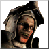
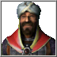
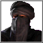
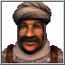
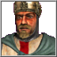
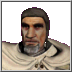
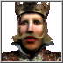
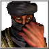
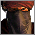
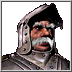

# Vanilla Lords

This section provides a detailed analysis of the 16 original AI Lords included in Stronghold Crusader and Stronghold Crusader Extreme. Each page breaks down a lord's economic strategy, military tactics, castle design, and overall personality, offering insights for both fighting against them and for creating your own custom AI.

---

## Crusader Lords

| Portrait | Lord | Playstyle |
| :---: | :--- | :--- |
|  | [**The Rat**](./Vanilla-Lords/Rat.md) | Overwhelming early-game spearman rusher. |
|  | [**The Snake**](./Vanilla-Lords/Snake.md) | Early-game harasser using archers, slaves and assassins. |
|  | [**The Pig**](./Vanilla-Lords/Pig.md) | Slow-building brute who attacks with macemen & crossbows. |
|  | [**The Wolf**](./Vanilla-Lords/Wolf.md) | Powerful late-game lord with strong castles and elite troops. |
|  | [**Saladin**](./Vanilla-Lords/Saladin.md) | Well-rounded Arabian lord with a strong economy and swordsmen. |
|  | [**The Caliph**](./Vanilla-Lords/Caliph.md) | Devious pyromaniac who uses slaves and fire throwers. |
|  | [**The Sultan**](./Vanilla-Lords/Sultan.md) | Kind, economy-focused lord who uses slingers and swordsmen. |
|  | [**Richard the Lionheart**](./Vanilla-Lords/Richard.md) | Balanced and powerful lord with a strong economy and army. |

## European Lords (Extreme)

| Portrait | Lord | Playstyle |
| :---: | :--- | :--- |
|  | [**Emperor Frederick**](./Vanilla-Lords/Frederick.md) | Emperor with a formidable cavalry and mighty sieges. |
|  | [**King Phillip**](./Vanilla-Lords/Phillip.md) | Aggressive king who attacks early and sends out his chivalric elite. |
|  | [**The Sheriff**](./Vanilla-Lords/Sheriff.md) | Stronger version of The Pig; Uses crossbows and macemen. |
|  | [**The Nizar**](./Vanilla-Lords/Nizar.md) | The original assassin lord; relies on stealth and large attacks. |
|  | [**The Wazir**](./Vanilla-Lords/Wazir.md) | Powerful fire-based lord with a strong economy. |
|  | [**The Emir**](./Vanilla-Lords/Emir.md) | Hit-and-run specialist who fields large groups of horse archers. |
|  | [**The Abbot**](./Vanilla-Lords/Abbot.md) | Defensive lord who builds monasteries and attacks with monks. |
|  | [**The Marshal**](./Vanilla-Lords/Marshal.md) | Veteran commander with a heavy focus on elite European knights. |
