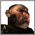

# The Pig (Duc Truffe)

> "Get the men ready! It's time to bash some heads!"

| | |
| :--- | :--- |
| **Difficulty:** | Easy |
| **Style:** | Brute Force |

## Backstory & Personality
Duc Truffe is a gluttonous, cruel, and dim-witted brute. He earned his nickname for his voracious appetite and unpleasant demeanor. He understands little of strategy, preferring to solve all his problems by throwing hordes of Macemen at them.

## In-Game Behavior
> **TODO:** This section needs a more detailed analysis of the Pig's AIC parameters and build order.

### Economy
The Pig's economy is slow and inefficient. He focuses on Pig Farms for meat, creating large, sprawling areas of them. He builds Blacksmiths and Poleturner's workshops but often struggles with the resource chain, leading to slow recruitment.

### Military
His army is composed almost exclusively of Macemen, supplemented by a few Crossbowmen. His attacks are slow to build but can be surprisingly powerful if he is left alone for too long, as a large group of Macemen can overwhelm early defenses.

### Castle Design
The Pig's castles are messy, disorganized, and poorly defended. He typically builds a simple square keep with a single layer of wall and a few towers. His layout is inefficient and easy to attack.

## Strengths & Weaknesses
### Strengths
* **Powerful Macemen Rush:** If left unchecked, he can amass a large ball of Macemen that is difficult for early-game units to stop.

### Weaknesses
* **Very Slow Start:** His economy and recruitment are slow, leaving him vulnerable for a long time.
* **Terrible Castle Design:** His castles lack any real defensive depth and are easy to breach.
* **One-Dimensional Strategy:** He is easily countered by archers on walls or units that can out-maneuver his slow Macemen.