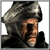

# The Wolf (Duc Volpe)

> "You've caused me enough trouble for one day, now... DIE!"

| | |
| :--- | :--- |
| **Difficulty:** | Very Hard |
| **Style:** | Turtle, Powerhouse |

## Backstory & Personality
Duc Volpe is the primary antagonist, a cruel, intelligent, and utterly ruthless commander. He is a master of siege warfare and castle defense, viewing his opponents with contempt and showing no mercy in battle.

## In-Game Behavior
> **TODO:** This section needs a more detailed analysis of the Wolf's AIC parameters and build order.

### Economy
The Wolf has one of the strongest economies in the game. He builds a well-organized and diverse European economy, focusing on bread production for food and iron for his elite troops. He maintains high taxes and a large population.

### Military
He fields the most powerful European units: Pikemen, Crossbowmen, Swordsmen, and Knights. He builds very large, powerful siege armies and is relentless in his attacks. His defensive crossbowmen on his towers are a major threat.

### Castle Design
The Wolf is a master castle builder. His castles are huge, formidable fortresses with thick, often doubled, stone walls, deep moats, and a labyrinth of towers and gatehouses designed to create deadly killing zones. His towers are always fully manned with defensive siege engines.

## Strengths & Weaknesses
### Strengths
* **Impenetrable Castles:** His castles are the toughest to crack in the entire game.
* **Powerful Late-Game Army:** His combination of heavy infantry and knights is devastating.
* **Strong Economy:** He can sustain long wars and quickly rebuild his forces.

### Weaknesses
* **Slow to Build:** His elaborate castles and expensive troops take a long time to field. He is most vulnerable to an all-out rush in the early game.